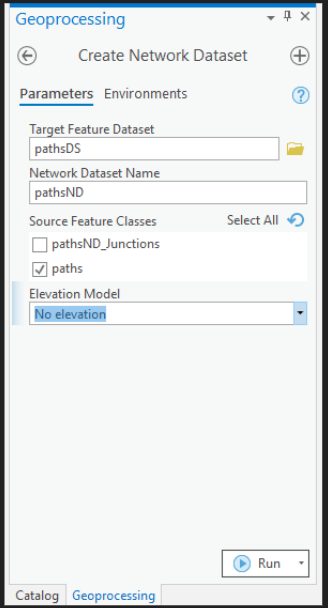

# Shortest-Network-Distance-From-An-Image
Using ArcGIS Pro and a satellite image of Nose Hill Park Calgary Alberta the shortest network distance between path locations is found.

### Create Network Dataset

### Correct Units to Meters

### Build the Network

### Create Route Analysis Layer

### Place Markers on Walking Paths

### Run Analysis to Find the Shortest Route Distance

### Results
#### Path 1
 
Shortest Route is 710.095 meters

#### Path 2
 
Shortest Route is 998.329 meters

#### Path 3
 
Shortest Route is 382.581 meters
